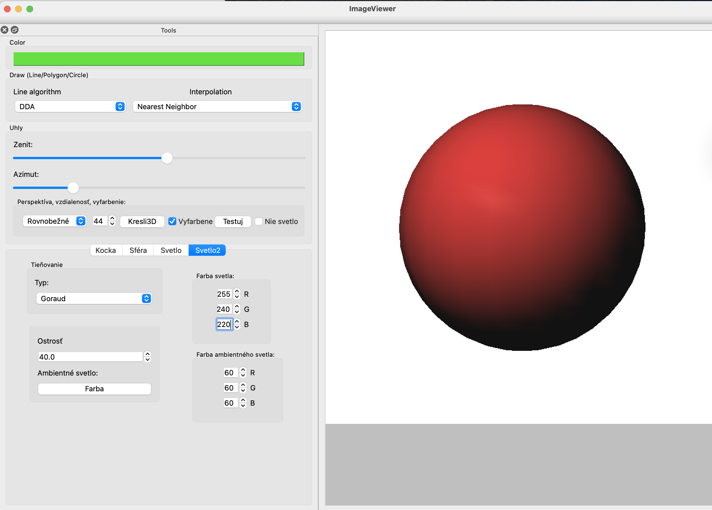
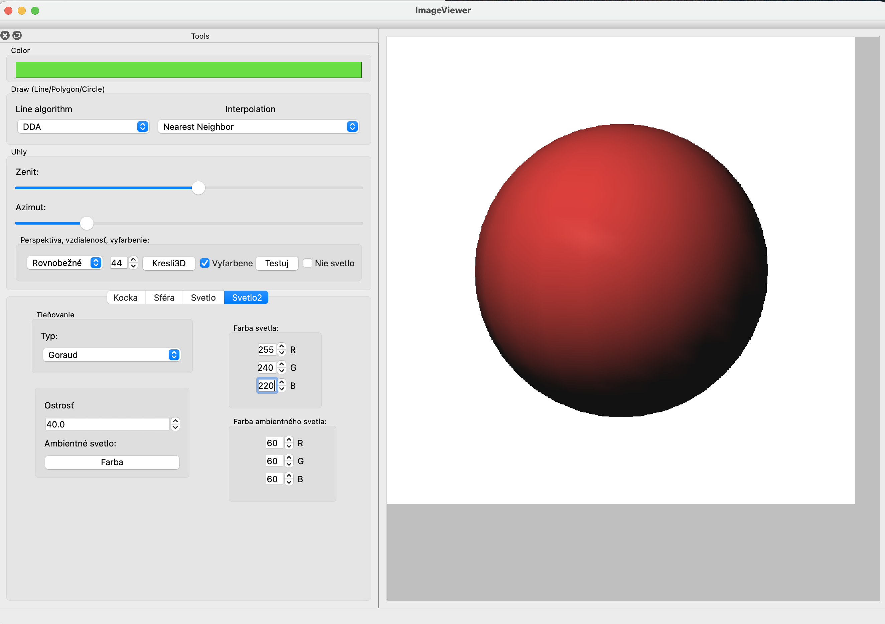
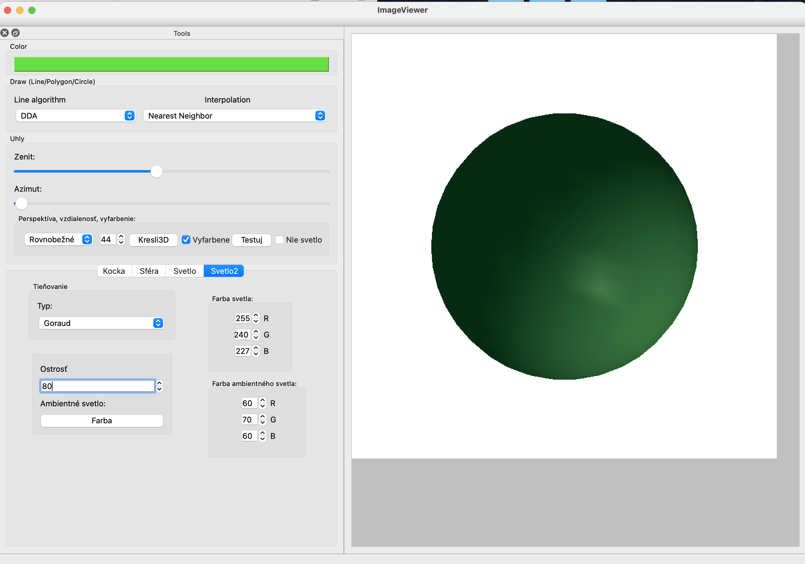
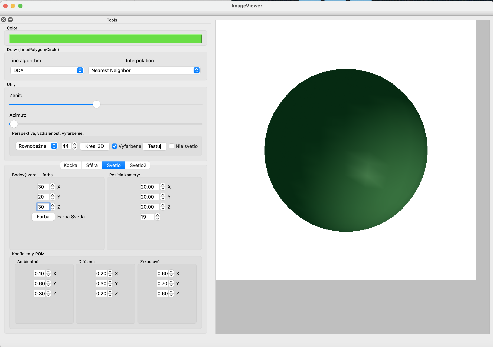
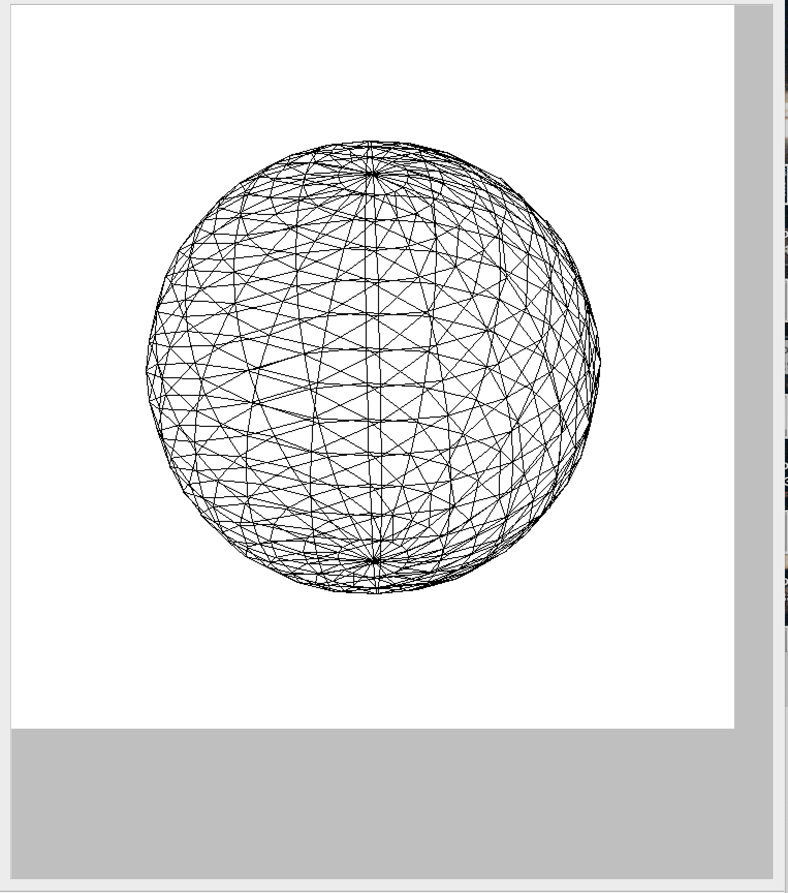

# 3D Graphics Renderer – Wireframe and Phong Shading

This project is an interactive **3D graphics renderer** that allows users to view and explore 3D models using **wireframe visualization**, **Phong illumination**, and various **shading and projection techniques**. Models are loaded from standard **VTK PolyData** files and rendered using a custom graphics pipeline.

---

## ✨ Features

### 🧱 Wireframe Visualization
- Load and display a **wireframe cube** model from a VTK PolyData file.
- Load and display a **triangular mesh of a sphere** (also from VTK format).

### 💡 Phong Lighting Model
Display an illuminated sphere using the **Phong reflection model**, with customizable parameters:

#### User-defined options:
- **Point light source**: position and RGB color
- **Camera position**: along the normal to the projection plane
- **Material properties**:
  - Ambient, Diffuse, Specular reflection (RGB triplets)
- **Shininess coefficient** for specular highlights
- **Ambient light color**

#### Shading modes:
- **Flat shading** (based on face normals or nearest vertex color)
- **Gouraud shading** (using barycentric color interpolation)

Triangle filling is performed using a **modified scan-line algorithm**, and **visibility is handled using a Z-buffer** with **barycentric Z-interpolation**.

---

### 🎥 Camera Control
- Control the projection view using **zenith (θ ∈ [0, π])** and **azimuth (φ ∈ [0, 2π])** angles via the UI.

---

### 🔭 Projection Options
- **Orthographic (parallel) projection**
- **Perspective projection**, with user-defined eye distance along the viewing direction.

---

### 🧵 Edge Rasterization
- Implemented using:
  - **DDA (Digital Differential Analyzer)** algorithm
  - or **Bresenham’s line algorithm**

---

## 📂 Input File Format

All 3D models must be in **VTK PolyData (.vtk)** format.

**Examples:**
- `cube.vtk` – A polygonal wireframe model of a cube
- `sphere.vtk` – A triangulated mesh of a sphere

---

## 🧰 Technologies

- Programming Language: C++ 
- Custom scanline rasterizer and z-buffer
- Mathematical modeling: Phong lighting, barycentric interpolation

---

## Screenshots

### Red Material – Soft Lighting

### Green Material – Warm Lighting

### Wireframe

**Author:** Hannah Kuklovska
**Year:** 2025  
